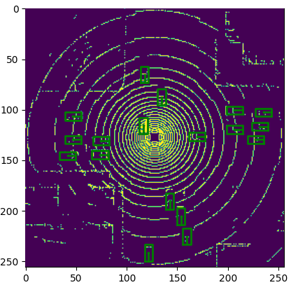
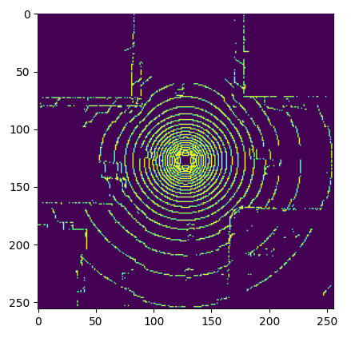
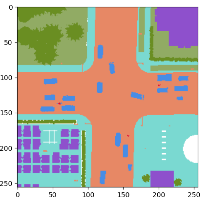

# Basic Visualization


Example visualization programs here are based on the **parsed dataset**.  
Please refer to [V2X-Sim 2.0 tutorial](https://ai4ce.github.io/V2X-Sim/tutorial.html) if you are looking for visualizations for the raw V2X-Sim dataset.

## Detection dataset
To visualize voxelized point cloud with ground-truth bounding box:
```python
import matplotlib.pyplot as plt

from coperception.datasets import V2XSimDet, V2XSimSeg
from coperception.configs import Config, ConfigGlobal
from coperception.utils.obj_util import *

split = 'train'
config = Config(binary=True, split=split, use_vis=True)
config_global = ConfigGlobal(binary=True, split=split)
data_path = f'/path/to/created/det/dataset/{split}/agent0'

v2x_det_dataset = V2XSimDet(
        dataset_roots=[data_path], split=split, config_global=config_global,
        config=config, val=True, bound='both')

padded_voxel_points, padded_voxel_points_teacher_det, label_one_hot, reg_target, reg_loss_mask, anchors_map, \
    vis_maps, gt_max_iou, filename, target_agent_id, num_sensor, trans_matrix = v2x_det_dataset[0][0]

plt.imshow(np.max(padded_voxel_points.reshape(256, 256, 13), axis=2), alpha=1.0, zorder=12)

# draw ground-truth bounding box
gt_max_iou_idx = gt_max_iou[0]['gt_box']
for p in range(v2x_det_dataset.pred_len):

    for k in range(len(gt_max_iou_idx)):
        anchor = anchors_map[tuple(gt_max_iou_idx[k][:-1])]
        encode_box = reg_target[tuple(gt_max_iou_idx[k][:-1]) + (p,)]
        decode_box = bev_box_decode_np(encode_box, anchor)
        decode_corner = center_to_corner_box2d(
                                    np.asarray([anchor[:2]]), 
                                    np.asarray([anchor[2:4]]),
                                    np.asarray([anchor[4:]]))[0]

        corners = coor_to_vis(decode_corner, v2x_det_dataset.area_extents, v2x_det_dataset.voxel_size)

        c_x, c_y = np.mean(corners, axis=0)
        corners = np.concatenate([corners, corners[[0]]])

        plt.plot(corners[:, 0], corners[:, 1], c='g', linewidth=2.0, zorder=20)
        plt.scatter(c_x, c_y, s=3, c='g', zorder=20)
        plt.plot([c_x, (corners[1][0] + corners[0][0]) / 2.], [c_y, (corners[1][1] + corners[0][1]) / 2.],
                    linewidth=2.0, c='g', zorder=20)

    occupy = np.max(vis_maps, axis=-1)
    m = np.stack([occupy, occupy, occupy], axis=-1)
    m[m > 0] = 0.99
    occupy = (m * 255).astype(np.uint8)

    free = np.min(vis_maps, axis=-1)
    m = np.stack([free, free, free], axis=-1)
    m[m < 0] = 0.5
    free = (m * 255).astype(np.uint8)
```
  


## Segmentation dataset
To visulize voxelized point cloud:  

```python
import matplotlib.pyplot as plt

from coperception.datasets import V2XSimDet, V2XSimSeg
from coperception.configs import Config, ConfigGlobal
from coperception.utils.obj_util import *

split = 'train'
config = Config(binary=True, split=split, use_vis=True)

data_path = f'/path/to/created/seg/dataset/{split}/agent0'

v2x_seg_dataset = V2XSimSeg(dataset_roots=[data_path],
                                split=split, config=config, val=True, kd_flag=True, bound='both', no_cross_road=False)

padded_voxel_points, padded_voxel_points_teacher, seg_bev = v2x_seg_dataset[0][0]
padded_voxel_points = padded_voxel_points.cpu().detach().numpy()

plt.imshow(np.max(padded_voxel_points.reshape(256, 256, 13), axis=2), alpha=1.0, zorder=12)
```
  

To show ground-truth visualization:
```python
import matplotlib.pyplot as plt

from coperception.datasets import V2XSimDet, V2XSimSeg
from coperception.configs import Config, ConfigGlobal
from coperception.utils.obj_util import *

split = 'train'
config = Config(binary=True, split=split, use_vis=True)

data_path = f'/path/to/created/seg/dataset/{split}/agent0'

v2x_seg_dataset = V2XSimSeg(dataset_roots=[data_path],
                                split=split, config=config, val=True, kd_flag=True, bound='both', no_cross_road=False)

padded_voxel_points, padded_voxel_points_teacher, seg_bev = v2x_seg_dataset[0][0]
padded_voxel_points = padded_voxel_points.cpu().detach().numpy()

gt_image = np.zeros(shape=(256, 256, 3), dtype=np.dtype("uint8"))

# map colors according to our scheme
for key, value in config.class_to_rgb.items():
    gt_image[np.where(seg_bev == key)] = value

plt.imshow(gt_image)
```
The color scheme is defined in `class_to_rgb` in:
::: coperception.configs.Config.Config

  

Other example basic visualization programs are provided in [coperception/tools/visualization/v2xsim_vistool_basic](https://github.com/coperception/coperception/tree/master/tools/visualization/v2xsim_vistool_basic)
